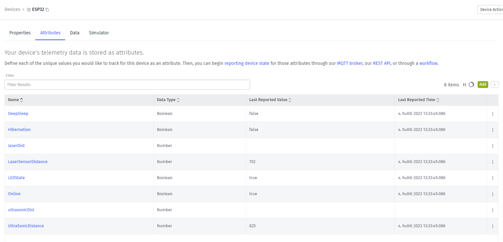

# Debri Identification System
[!NOTE]
This is a school project, used in an IIoT course.

An IIoT project, based on a ESP32 powered microcontroller that uses laser sensor and ultrasonic sensor to measure distance between objects and sends data to a Losant server. 

Attributes sent to server:

Losant dashboard layout:

